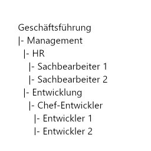
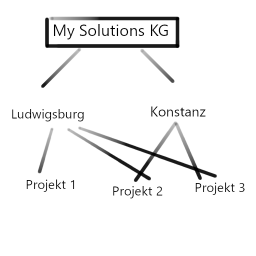
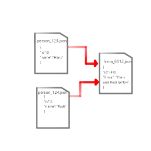

# Grundlegende Konzepte

## 1. Wieso Datenbanken?

Datenbanken bieten eine Reihe von Vorteilen gegenüber Dateisystemen:

* Dateispeicherung ermöglicht nur begrenzte Abfragen und Einschränkungen bei der Verwaltung von Daten  
* Datenbanken ermöglichen schnellere und effizientere Abfrage von Daten durch Indizes und Abfragesprachen (SQL)  
* Datenbanken ermöglichen die Verwaltung von Beziehungen zwischen Daten, was in Dateispeicherung schwierig ist  
* Höhere Skalierbarkeit und Verfügbarkeit von Daten im Vergleich zu Dateispeicherung
* Sicherheitsfunktionen wie Benutzerauthentifizierung und Berechtigungen, die bei der Dateispeicherung nicht vorhanden sind  
* Synchrone Abfragen sind möglich  
* Redundanzen können vermieden werden
* Verwaltung und Ansichten von Daten werden vereinfacht und erklären Beziehungen und Sortierungen
* Effizienz und Benutzerfreundlichkeit steigen

--- 

## 2. Ebenen der Datenbank

Eine Datenbank ist eine Sammlung von Daten, die organisiert und auf eine bestimmte Weise gespeichert werden, um schnelle und effiziente Abfragen und Manipulationen zu ermöglichen. Um dies zu erreichen, besteht die Datenbankstruktur aus drei Ebenen: die physische Ebene, die logische Ebene und die Sicht-Ebene. 

### 2.1 Sicht-Ebene (Oberste Ebene)

Die Sicht-Ebene ist die höchste Ebene der Datenbankstruktur und beinhaltet die Sicht-Datenstrukturen, die die Daten speichern. Diese Datenstrukturen können Tabellen, Relationen oder Objekte sein und sind auf die Bedürfnisse des Benutzers abgestimmt, wie z.B. die Front-End Ansicht, die Benutzeransicht, die Datenanalyse etc. Es ist die Ebene, auf der die Daten in einer Datenbank gespeichert werden und die die Interaktion mit dem Benutzer ermöglicht.

### 2.2 Logische Ebene (Mittlere Ebene)

Diese Ebene beschreibt die logische Organisation der Daten innerhalb der Datenbank. Es geht um die Definition der Tabellen, Felder, Beziehungen und Indizes, die in einer Datenbank verwendet werden und die Verknüpfungen herstellen. Es beschreibt auch die Regeln und Constraints, die auf die Daten angewendet werden, um die Integrität der Daten sicherzustellen. Diese Ebene konzentriert sich auf die Erstellung abstrakter Konzepte wie Tabellen, Felder, Beziehungen und Indizes, die die logische Struktur der Daten definieren und die Organisation und Verknüpfung der Daten erleichtern.

### 2.3 Physische Ebene (Unterste Ebene)

Die physische Ebene ist die tiefste Ebene der Datenbankstruktur und beinhaltet die physischen Datenstrukturen, die die Daten speichern. Diese Datenstrukturen können Dateien, Blöcke oder Seiten sein und sind abhängig von der verwendeten Hardware und der Art der Datenspeicherung. Es ist die Ebene, auf der die Daten tatsächlich gespeichert werden und bezieht sich auf die tatsächlichen physischen Speichermedien, auf denen die Daten gespeichert werden und die Zugriffsmethoden auf diese Daten.

--- 

## 3. SQL or NO?

SQL ist eine Abfragesprache, die verwendet wird, um Daten aus einer Datenbank abzurufen. Es ist die häufigst verwendete Abfragesprachen und wird von relationalen Datenbanken wie MySQL, Oracle, Microsoft SQL Server und SQLite unterstützt.

Datenbanken, die SQL nicht _direkt_ unterstützen, werden als nichtrelationale Datenbanken bezeichnet. Beispiele für nichtrelationale Datenbanken sind MongoDB, CouchDB, Redis, Neo4j und Cassandra. Sie werden auch als NoSQL-Datenbanken bezeichnet, wobei NoSQL für "Not Only SQL" steht. 

--- 

## 4. Datenbankmodellierung

### 4.1 Relationales Modell

Dies ist das am häufigsten verwendete Datenbankmodell. Es organisiert Daten in Tabellen mit Zeilen und Spalten. Jede Tabelle hat einen primären Schlüssel, der verwendet wird, um Beziehungen zwischen Tabellen herzustellen. Dieses Modell ermöglicht es, komplexe Abfragen durchzuführen und Beziehungen zwischen Daten herzustellen.

Beispiel: Elektronische Bibliothek - Bücher werden in Tabellen gespeichert, Beziehungen zwischen Tabellen und Autoren bestehen.

### 4.2 Hierarchisches Modell

Dieses Modell organisiert Daten in einer Hierarchie. Es ist eine Baumstruktur, die Daten in Form von Knoten speichert. Jeder Knoten kann mehrere Kinder haben, aber nur einen Elternknoten. Jede Ebene der Hierarchie hat eine eindeutige Identität und es besteht eine eindeutige Beziehung zwischen Eltern- und Kindelementen. Es ist einfacher zu verwalten als das Netzwerkmodell, jedoch nicht so flexibel.

Beispiel: Unternehmensstruktur (Organigramm) - Mitarbeiter werden in einer Hierarchie organisiert, die Beziehungen zwischen Mitarbeitern und Vorgesetzten herstellt.

### 4.3 Netzwerkmodell

Dieses Modell organisiert Daten in Netzwerkstrukturen, die Beziehungen zwischen Daten darstellen. Es ermöglicht es, komplexe Beziehungen zwischen Daten zu modellieren, erfordert jedoch höheren Verwaltungsaufwand.

Beispiel: Flugbuchungssystem - Flüge werden in Netzwerkstrukturen organisiert, die Beziehungen zwischen Flügen und Passagieren herstellen.

### 4.4 Dokumentorientiertes Modell

Dieses Modell organisiert Daten in Dokumenten, die ähnlich wie JSON oder XML strukturiert sind. Es ermöglicht es, unstrukturierte Daten zu speichern und zu suchen, und eignet sich besonders gut für Anwendungen, die eine große Menge unstrukturierter Daten verarbeiten.

Beispiel: Blog - Blog-Posts werden in Dokumenten gespeichert, die Beziehungen zwischen Blog-Posts und Autoren herstellen.