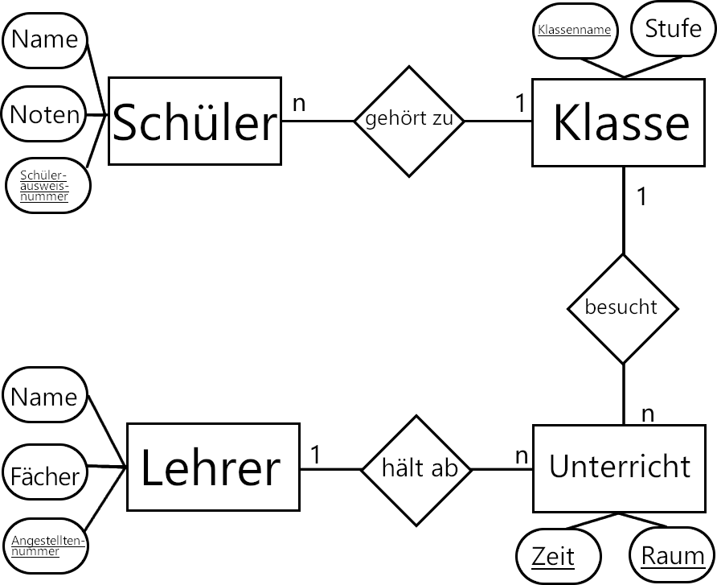

# Entity Relationship Modell (_Chen-Notation_)

Um Daten sinnvoll abzuspeichern, abzufragen, darzustellen und zu verarbeiten, bedingt es eines guten __Modells__. Während ein Datenmodell zwar hauptsächlich die Grundlage einer __relationalen Datenbank__ darstellt, ist es eben auch für die Konzeption der Software wichtig, die mit diesen Daten arbeiten soll. 

Das Entity Relationship Modell _(kurz: ERM)_ wird verwendet, um die Beziehungen zwischen abstrakten Konzepten visuell und leicht verständlich darzustellen. Der Herausgeber des __ERM__ _Peter Chen_ schlug sein Modell auch als Faustregel der Semantik natürlicher Sprachen vor.

Seit Chen wurde das __Entity Relationship Modell__ weiterentwickelt und spezialisiert, sodass eben auch ein __Unified Modelling Language__-Standart _(kurz: UML)_ existiert. Folgend wird dennoch aufgrund der Überschaulichkeit die Chen-Notation gewählt.

## Elemente

### Entity _(Entität)_

* Quader
* sprachliches Pendant: __Nomen__
* Entität bezeichnet ein abstraktes Konzept, das als __einzigartig__ identifizierbar ist.
* __Beispiel:__ _Baum_ ist ein abstraktes Konzept, dass sich von anderen Lebewesen unterscheidet, und dessen __konkrete Realisierungen__ jeweils __einzigartig__ sind und sich so voneinander unterscheiden.
* __Daraus folgt:__ Jede Entität besitzt __mindestens__ einen __Primary Key__, gekennzeichnet durch Unterstreichung des jeweiligen Attributs, der die _Identität der jeweiligen Realisierung_ darstellt.

### Relationship _(Beziehung)_

* Raute
* sprachliches Pendant: __Verben__
* auf spezielle Beziehungsbezeichnung sollte geachtet werden, um die Struktur und Lesbarkeit zu wahren. Auf das Verb _"haben"_ sollte gänzlich verzichtet werden, da es zum einen zu unspezifisch und zum anderen zu allgemeingültig ist.

### Cardinalities _(Kardinalitäten)_

* Verbindet Entitäten über eine Beziehung
* Gibt die Kardinalität, also das Zahlenverhältnis, zwischen zwei Entitäten dar:
  * __1 - 1__: 1 zu 1 (Beispiel: __1__ Benutzer greift zu auf __1__ Konto) 
  * __1 - n__: 1 zu Viele (Beispiel: __1__ Warenkorb beinhaltet __n__ Artikel)
  * __m - n__: Viele zu Viele (Beispiel: __m__ Bücher geschrieben von __n__ Autoren)

### Attribute _(Eigenschaft)_

* Oval
* sprachliches Pendant: __Adjektive__
* mindestens ein __Primary Key__ pro Entität.
  
## Vorteile
* Selbst komplexe Sachverhalte können relativ intuitiv dargestellt werden.
* Bei gründlicher Planung des __ERM__, fällt das Modellieren der Datenbank deutlich einfacher.

## Nachteile
* Funktionsweise der einzelnen Entitäten bleibt unberücksichtigt.

>## Beispiel
>Darstellung einer klassischen Unterrichtssituation.
>
>
