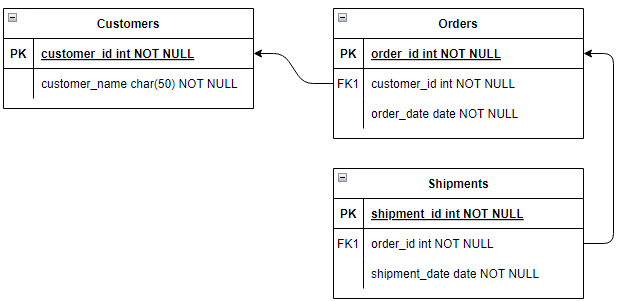

# Datenbankdiagramm

Das UML-Datenbankdiagramm ermöglicht es, die logischen Strukturen und Beziehungen in einer Datenbank visuell darzustellen. Es ist ein wertvolles Werkzeug, um die Anforderungen eines Datenbanksystems zu analysieren und zu spezifizieren und die Entwicklung eines Datenbankschemas zu planen.
